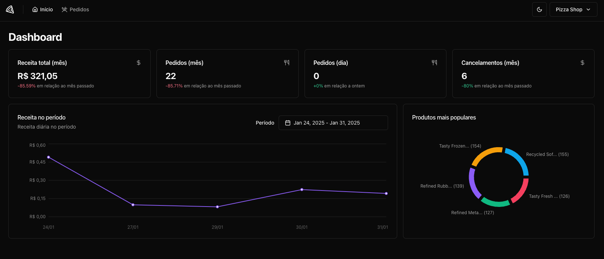

# 🍕 Pizza Shop

> A modern and efficient order management system for restaurants, featuring real-time metrics and automated testing.

## 🚀 Technologies Used

### Backend

- ⚡ **Bun** - Fast and efficient JavaScript runtime
- 🏗 **Elysia** - Lightweight and powerful backend framework
- 🗄 **Drizzle** - Type-safe SQL ORM
- 🐳 **Docker** - Containerized deployment

### Frontend

- ⚡ **Vite** - Fast build tool for modern web projects
- 📦 **pnpm** - Efficient package manager
- 📊 **Beautiful Charts** - Data visualization for key business metrics
- ✅ **Vitest** - Automated testing for frontend components

## 📸 Project Preview

---

Made with ❤️ by [Ricardo Fernandes](https://github.com/iricardofernandes)

